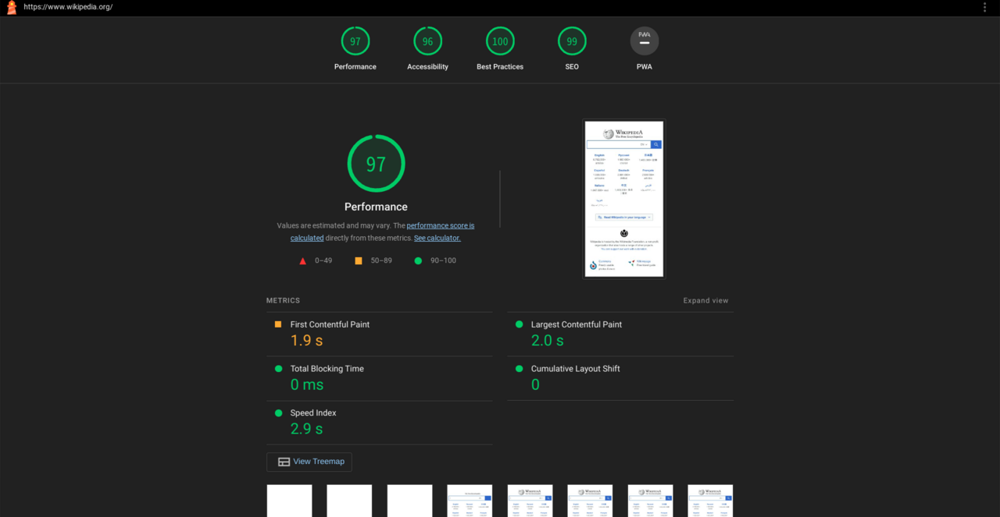

# Over-Engineering globalGlob.dev: The Bad Ideas that got a 100 Lighthouse Score

with AL Rodriguez

---

# Duende Software

- Full Disclosure: They pay me (but I like them anyway)
  - Customer Success Engineer

---

# Shameless Self Promotion

- @ProgrammerAL and https://ProgrammerAL.com
- Freelance Affiliate at https://globalGlob.dev 
  - Index 0 for Dev News

---

# globalGlob(*\*/\*)

- Satire
- Articles/Videos/Newsletter
- Deployed December 2025

---

# Typical Static Site Generator

- Build Time
- Astro/Hugo/Jekyll/11ty

---

# (2018) What if I made my own static site generator?

- And made it crazy?!

---

# My Vision

- Blog Site
- Users upload a post
- Site generates the HTML, stores in cloud storage
- All requests receive that HTML
- Started work in 2017

---

# There were problems

- How do you update the HTML?
- How do you update styles?
- What does/doesn't get cached?
- Idea Abandoned: 2018

---

# 2025 - I want to make jokes

- Jokes...on the internet
- 8 year old idea
  - Bad then, great now

---

# Admin Functionality

- Accidental CMS

---

# Website

- Frontend
  - Static site
  - Main Pages Static Code
  - Dynamic Pages are generated when published or updated
    - Articles, Index, and Category pages

- Backend
  - Server-side functionality to retrieve data

---

# Goals

- Fast Site
- Do everything "right"
  - Security Headers, Static HTML, Minified and Cached Content
- Lighthouse Score 100
  - Not 99!

---

# What it Lighthouse?

- Audits Website Metrics
  - Emphasis: User Experience
  - Fast server response, security headers, valid HTML, etc
- Developed by Google

---

# Social Media Scores

- September 24, 2026 on Brave Desktop

|           | Performance | Accessibility | Best Practices | SEO |
|-----------|-------------|---------------|----------------|-----|
| Bluesky   | 66          | 80            | 96             | 92  |
| Instagram | 64          | 83            | 81             | 92  |
| Twitter   | 63          | 66            | 77             | 92  |
| LinkedIn  | 69          | 90            | 92             | 83  |

---

# Misc Astro Sites

- September 24, 2026 on Chrome Desktop

|                           | Performance | Accessibility | Best Practices | SEO |
|---------------------------|-------------|---------------|----------------|-----|
| designcember.web.app      | 99          | 88            | 96             | 100 |
| ikea.com                  | 98          | 96            | 100            | 100 |
| developers.cloudflare.com | 99          | 89            | 96             | 92  |
| docs.duendesoftware.com   | 98          | 100           | 77             | 92  |
| freshjuice.dev            | 100         | 100           | 100            | 100 |

---

# Reaching Maximum Lighthouse

- Optimize the UI
- Use Valid HTML
- Add Security Headers

---

# Optimize the UI - Caching

- Caching

---
---
---
---
---
---

# Review

- 
- 
- 

