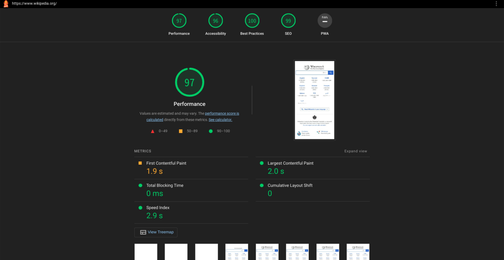

# Over-Engineering globalGlob.dev: The Bad Ideas that got a 100 Lighthouse Score

with AL Rodriguez

---

# Duende Software

- Full Disclosure: They pay me (but I like them anyway)
  - Customer Success Engineer

---

# Shameless Self Promotion

- @ProgrammerAL and https://ProgrammerAL.com
- Freelance Affiliate at https://globalGlob.dev 
  - Index 0 for Dev News

---

# Content Warning

- Bad Ideas Ahead

---

# globalGlob(*\*/\*)

- Satire
- Articles/Videos/Newsletter
- Deployed December 2025

---

# Typical Static Site Generator

- Build Time
- Astro/Hugo/Jekyll/11ty

---

# (2018) What if I made my own static site generator?

- And made it crazy?!

---

# My Vision

- Blog Site
- Users upload a post
- Site generates the HTML, stores in cloud storage
- All requests receive that HTML
- Started work in 2017

---

# There were problems

- How do you update the HTML?
- How do you update styles?
- What does/doesn't get cached?
- Idea Abandoned: 2018

---

# 2025 - I want to make jokes

- Jokes...on the internet
- 8 year old idea
  - Bad then, great now

---

# Admin Functionality

- Accidental CMS

---

# Website

- Frontend
  - Static site
  - Main Pages Static Code
  - Dynamic Pages are generated when published or updated
    - Articles, Index, and Category pages

- Backend
  - Server-side functionality to retrieve data

---

# Goals

- Fast Site
- Do everything "right"
  - Security Headers, Static HTML, Minified and Cached Content
- Lighthouse Score 100
  - Not 99!

---

# What it Lighthouse?

- Audits Website Metrics
  - Emphasis: User Experience
  - Fast server response, security headers, valid HTML, etc
- Developed by Google

---

# Social Media Scores

- September 24, 2026 on Brave Desktop

|           | Performance | Accessibility | Best Practices | SEO |
|-----------|-------------|---------------|----------------|-----|
| Bluesky   | 66          | 80            | 96             | 92  |
| Instagram | 64          | 83            | 81             | 92  |
| Twitter   | 63          | 66            | 77             | 92  |
| LinkedIn  | 69          | 90            | 92             | 83  |

---

# Misc Astro Sites

- September 24, 2026 on Chrome Desktop

|                           | Performance | Accessibility | Best Practices | SEO |
|---------------------------|-------------|---------------|----------------|-----|
| designcember.web.app      | 99          | 88            | 96             | 100 |
| ikea.com                  | 98          | 96            | 100            | 100 |
| developers.cloudflare.com | 99          | 89            | 96             | 92  |
| docs.duendesoftware.com   | 98          | 100           | 77             | 92  |
| freshjuice.dev            | 100         | 100           | 100            | 100 |

---

# Reaching Maximum Lighthouse

- Make it Fast
  - Static HTML
- Make it Right
  - Use Valid HTML
  - Add Security Headers

---

# Static Site

- Harder than you think
- Mix Static with Dynamic
- 

---

# Static Site - The globalGlob.dev Way

- Some Static Pages
  - /about, /disclaimer, /staff
- Some `Lit` modules
  - Some loose TypeScript
- Some pages generated at runtime, placed in cloud storage
  - /index, /articles, every "paging" page

---

# Static Site - The globalGlob.dev Way - Static Pages

- Hand written
- Minimal '`Lit`' modules
  - Header and Footer
- CSS file per page
  - Reduces accidental bloat

---
---
---
---

# Limited Dynamic Content - The globalGlob.dev Way

- Site Header is *sometimes* dynamic
  - Index and other static pages
  - Reset each time a generated page is re-generated
- Re-generate page when needed, or want to

---

# Limited Dynamic Content - The globalGlob.dev Way

---

# Limited Dynamic Content

- Repaints Lower Performance Score

---

# Optimize the UI - Caching

- Caching

---

# Cache Responses

- 

---

# Cache Responses - The globalGlob.dev Way

- Use '`etag`' heavily
- Remove query string

---

# Cache Responses - The globalGlob.dev Way - ETag

- Arbitrary string for
  - Cache Id
  - globalGlob uses timestamp content is generated

---

# globalGlob.dev Page Cache Strategy

<!-- 
architecture-beta
    service site(server)[Site]
    service siteApi(server)[Site API]
    service storageApi(server)[Storage API]
    service publisherApi(server)[Publisher API]
    service r2(disk)[Cloudflare R2]
    service kv(disk)[Cloudflare KV]

    site:R -- L:siteApi
    siteApi:T -- B:r2
    r2:R -- L:storageApi
    siteApi:T -- B:kv
    siteApi:R -- L:publisherApi
    publisherApi:T -- B:storageApi

    align row kv r2 storageApi
    align row site siteApi publisherApi
-->
---

# globalGlob.dev Page Cache Strategy

<!-- 
flowchart TD
    A[Request] -\->|Get money| B(Load Version Number from Storage)
    B -\-> C{Version == ETag?}
    C -\->|Yes| D
    C -\->|No| E[Re-Generate Page - Store with Version]
    E -\->D[Return HTML] 
-->

---

# Cache Responses - The globalGlob.dev Way - Query String

- Remove Query String
  - '`?a=123&b=456`' vs '`?b=456&a=123`'
  - https://calendar.perfplanet.com/2025/fixing-the-url-params-performance-penalty
- Anyone can add query string
  - https://community.cloudflare.com/t/facebook-now-adds-fbclid-query-string-to-urls-busting-cloudflares-cache/40355
- Cloudflare setting to force it off

---
---
---
---
---

# CSS

---
---

# Images

- Smaller files are better
  - Prioritize SVG
  - Otherwise, whatever's smaller
  - Use '`sizes`' property
- Lazy Load

---
---
---
---
---

# Misc Lighthouse Rules

- Standards Compliant '`robots.txt`' file

---
---

# Review

- 
- 
- 

