

# Coding C# with C#

with AL Rodriguez

---

# Shameless Self Promotion

- @ProgrammerAL and https://ProgrammerAL.com
- Customer Success Engineer at Duende Software
- Freelance Affiliate at https://globalGlob.dev 
  - Index 0 for Dev News

---

# Why are we here? To talk about...

- Automation!!!
  - Enforce Code Quality
- Automating Code with code
  - Writing and Checking the code
- Specifically C# Analyzers and C# Source Code generation
  - Hopefully everyone else gets something out of this too

---

# For non-.NET Devs

- git hooks
- .editorconfig
- Linters, write your own
- Things you can commit to the repo

---

# But Why? We have A.I. and Employer Pays For the Tokens

- Consistency
- Another check to force A.I. to do it right
- Humans are on the hook for A.I. work

---

# History Recap: C# Compiler

* 2000: Compiler written in C++
  - Big-Bang features added each update
  - Very few small features.
* 2011: Roslyn Compiler released
  - Full rewrite in C#
    - With knowledge of how C# is used
  - Added hooks into the compilation process

---

# Roslyn Syntax Tree

---

# Helpful Tools: Roslyn Syntax Visualization

- https://sharplab.io
- Built into Rider: Syntax Tree Visualizer
- Extension in Visual Studio: https://learn.microsoft.com/en-us/dotnet/csharp/roslyn-sdk/syntax-visualizer

---

# Rosyln Analyzer

- Keyword: Analyzer
- Checks code text for rules
  - Errors, Warnings, Suggestions, etc
- Reads code syntax using syntax tree

---

# Are they used often? Yes!

- Code analysis built-in is all Roslyn Analyzers
  - https://learn.microsoft.com/en-us/dotnet/fundamentals/code-analysis/overview
- Many 3rd Party Analyzer NuGet packages
  - SonarAnalyzer.CSharp
  - Roslynator.Analyzers
  - StyleCop.Analyzers
  - SerilogAnalyzer
  - xunit.analyzers
  - MongoDB.Analyzer

---

# Code Overview

- Existing Analyzer:
  - https://github.com/ProgrammerAL/required-auth.analyzer
- Scenario:
  - Require `[Authorize]`/`[AllowAnonymous]` attribute in controller files

---

# 3 Projects

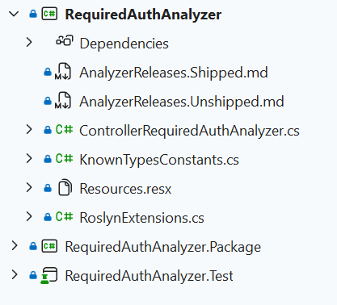

---

# Normal csproj file

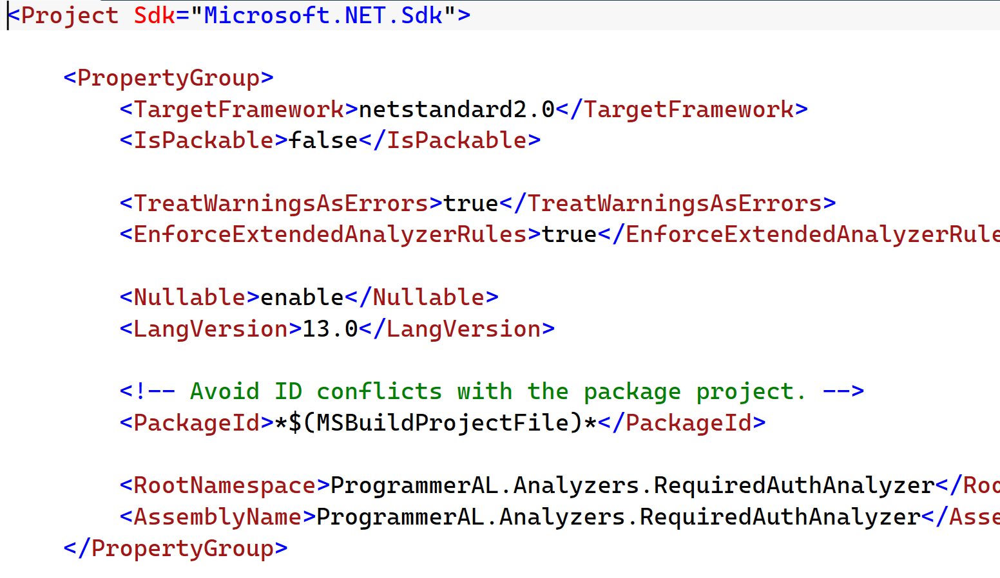

---

# Analyzer Class - ControllerRequiredAuthAnalyzer

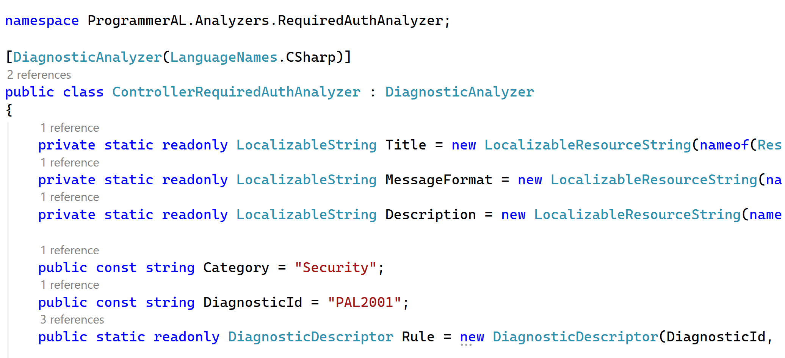

---

# Initialize()

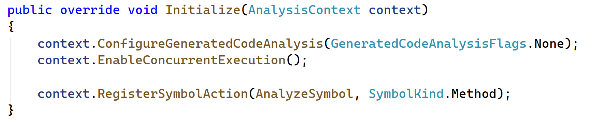

---

# AnalyzeSymbol()

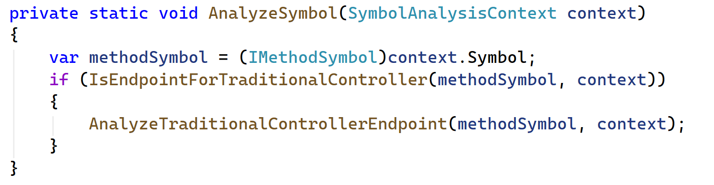

---

# IsEndpointForTraditionalController()

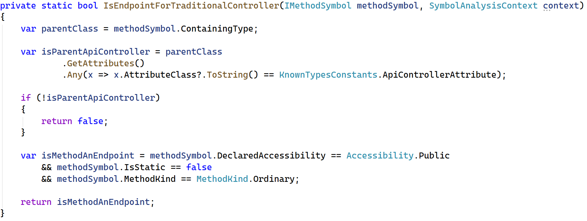

---

# AnalyzeTraditionalControllerEndpoint()

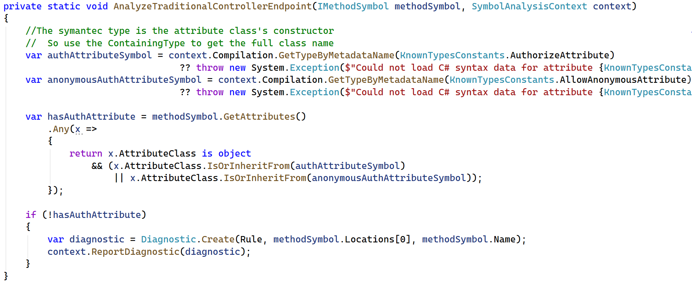

---

# Sample Unit Test

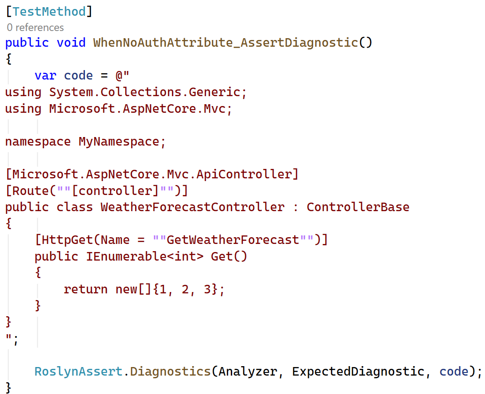

---

# C# Source Generator

- Code created in-memory at compile time
  - Can write to files if flag enabled in project, all or nothing
- Written using same Roslyn Syntax Tree API as Analyzers
- Additive only, cannot modify code

---

# Are they used often? Yes!

- .NET Team adding them for AoT support, or to remove reflection, for performance
- Public List:
  - https://github.com/amis92/csharp-source-generators

---

# If Only the Docs were Better...

- Cookbook: https://github.com/dotnet/roslyn/blob/main/docs/features/incremental-generators.cookbook.md
- Andrew Lock's blog series: https://andrewlock.net/series/creating-a-source-generator

---

# Demo Time

- Existing Generator:
  - https://github.com/ProgrammerAL/public-interface-generator
- Scenario:
  - Generate interface code from a class
  - Only use it for internal interfaces needed for unit tests

---

# Usage Example

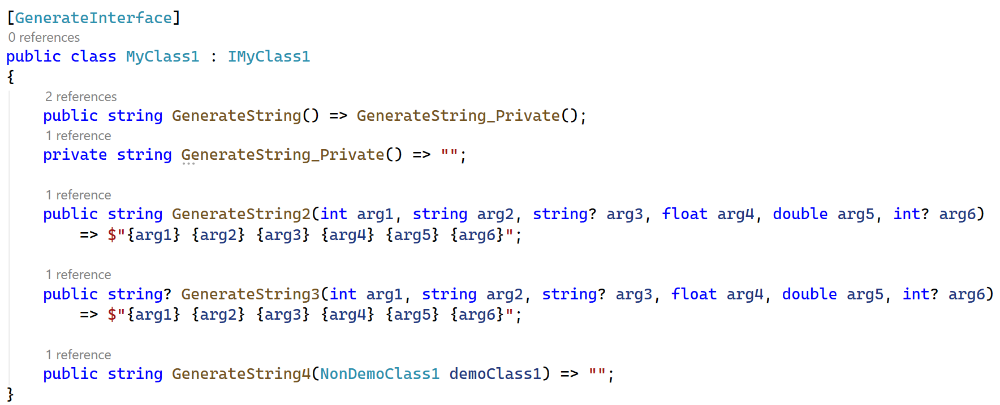

---

# Generated Interface

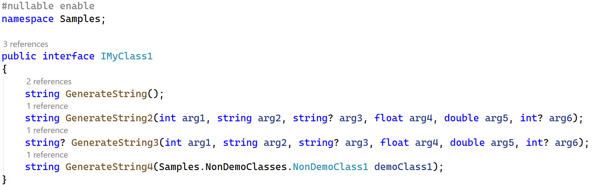

---

# Generator Class

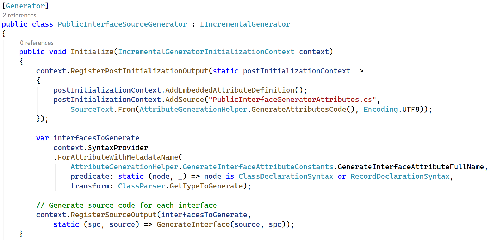

---

# GenerateAttributesCode()

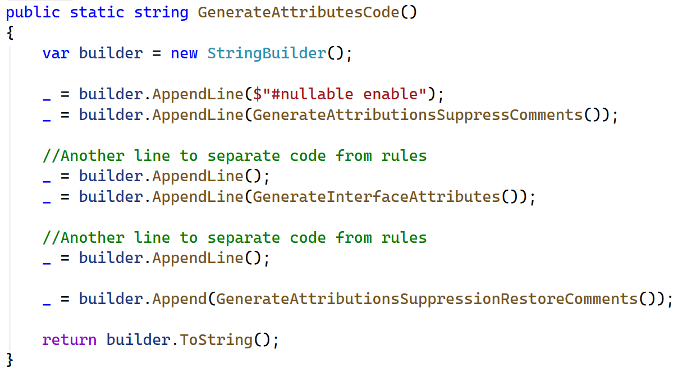

---

# GenerateInterface()

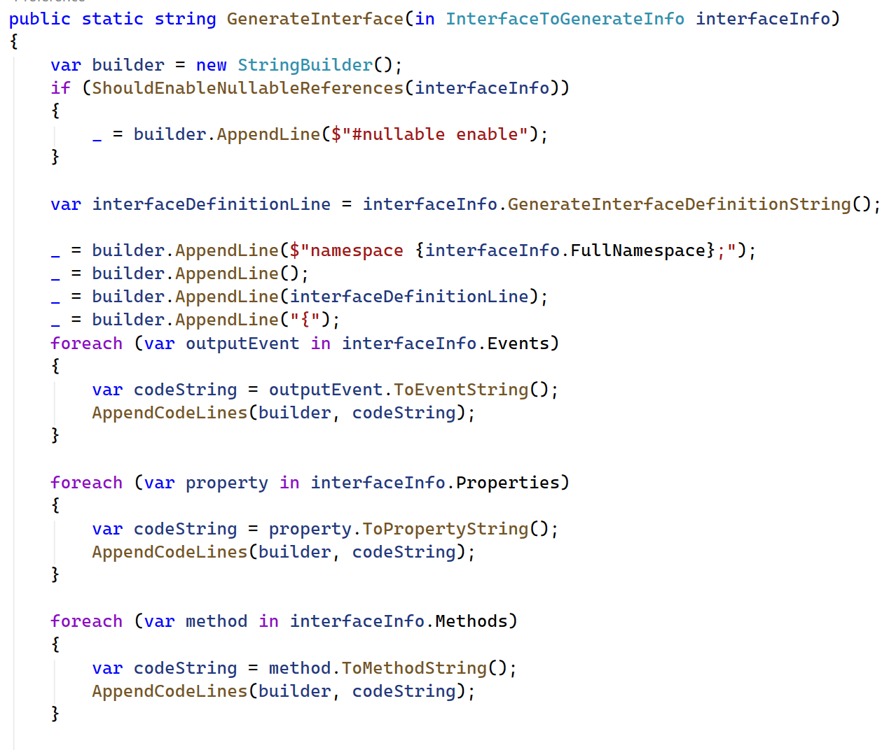

---
# Example Unit Test

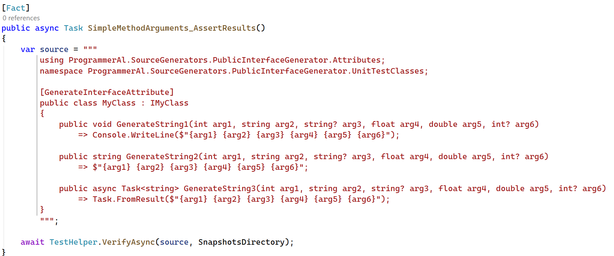

---

# Review

- Automate your code
- Add custom hooks to compiler
- Roslyn Analyzer -> check code
- Source Generator -> add code
- API is specific to parsing code tree

