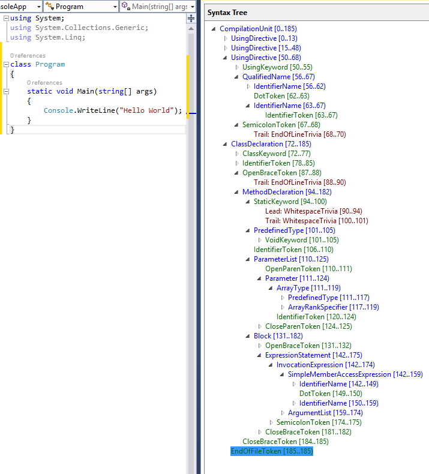

# Coding C# with C#

with AL Rodriguez

---

# Shameless Self Promotion

- @ProgrammerAL and https://ProgrammerAL.com
- Customer Success Engineer at Duende
- Freelance Affiliate at globalGlob.dev

---

# Why are we here? To Review!

- C# analyzers
- C# source code generation
- How these are already built into C#
* Note: Everything Mentioned is Free

---

# History Recap: C# Compiler

* 2000: Compiler written in C++
  - Big-Bang features added each update
  - Tech debt added over time
* 2011: Roslyn Compiler released
  - Full rewrite in C#
    - With knowledge of how C# is used
  - Added hooks into the compilation process

---

# Roslyn Syntax Tree

---

# Helpful Tools: Roslyn Syntax Visualization

- https://sharplab.io
- Built into Rider: Syntax Tree Visualizer
- Extension in Visual Studio: https://learn.microsoft.com/en-us/dotnet/csharp/roslyn-sdk/syntax-visualizer

---

# Rosyln Analyzer

- Keyword: Analyzer
- Checks code for rules
  - Errors, Warnings, Suggestions, etc
- Reads code syntax using syntax tree

---

# Are they used often? Yes!

- Code analysis built-in is all Roslyn Analyzers
  - https://learn.microsoft.com/en-us/dotnet/fundamentals/code-analysis/overview
- Many 3rd Party Analyzer NuGet packages
  - SonarAnalyzer.CSharp
  - Roslynator.Analyzers
  - StyleCop.Analyzers
  - SerilogAnalyzer
  - xunit.analyzers
  - MongoDB.Analyzer

---

# Demo Time

- Existing Analyzer:
  - https://github.com/ProgrammerAL/required-auth.analyzer
- Scenario:
  - Require `[Authorize]`/`[Anonymous]` attribute in controller files

---

# Extra Credit: Roslyn Analyzer Code Fix

- Analyzers can edit code to comply with the rule
- Analyzer generates the code change, user approves it

---

# C# Source Generator

- Code created in-memory at compile time
  - Can write to files if flag enabled in project, all or nothing
- Written using same Roslyn Syntax Tree API as Analyzers
- Additive only, cannot modify code

---

# Are they used often? Yes!

- .NET Team adding them for AoT support, or to remove reflection, for performance
- Public List:
  - https://github.com/amis92/csharp-source-generators

---

# Useful Source Generator Links

- Cookbook: https://github.com/dotnet/roslyn/blob/main/docs/features/incremental-generators.cookbook.md
- Andrew Lock's blog series: https://andrewlock.net/series/creating-a-source-generator

---

# 2 Types of Source Generators

- Incremental
  - Always do this one
  - Added in .NET 6
  - v2 of the API
- Non-Incremental
  - Added in .NET 5
  - v1 of the API

---

# Demo Time

- Existing Generator:
  - https://github.com/ProgrammerAL/public-interface-generator
- Scenario:
  - Generate interface code from a class
  - Only use it for internal interfaces needed for unit tests

---

# Review

- Add custom hooks to compiler
  - Roslyn Analyzers to check code
  - Source Generators to add code
- API is specific to parsing code tree

---

  
Content

  
Feedback

  

  

  

  

