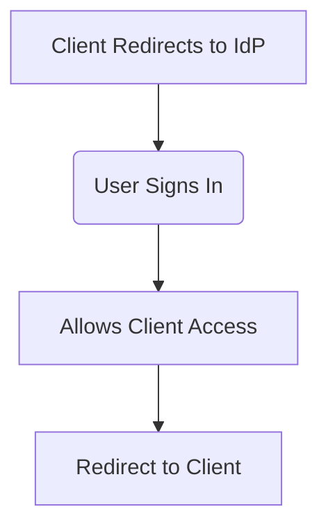
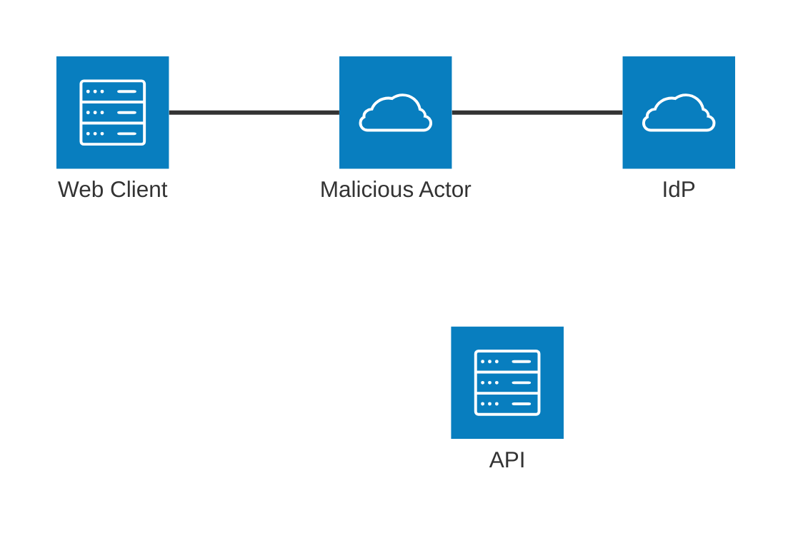
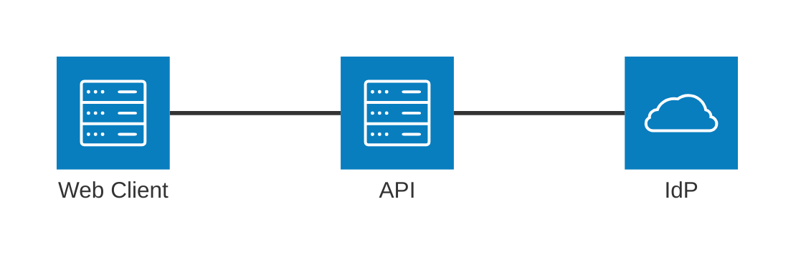

<style>
section::before {
  content: url('https://raw.githubusercontent.com/ProgrammerAL/Presentations-2026/main/common-images/duende-logo-rebranded.svg');
  transform: scale(.25);
  position: absolute;
  right: -320px;
  bottom: -65px;
}
</style>

# Today's "Best Practices" of User Authentication

with AL Rodriguez


---

# Shameless Self Promotion

- @ProgrammerAL and https://ProgrammerAL.com
- Customer Success Engineer at Duende Software
- Freelance Affiliate at https://globalGlob.dev 
  - Index 0 for Dev News


---

# Why are we here?

- AuthN - Trusting Who a User Is
- Best Practices of AuthN

---

# What is a "Best Practice"?

- __*Usually*__ a good idea
- Can be the default
- Might not be what you need, depends on your use case
- When you're not sure:
  * pay a consultant

---

# Where to Start?

- OAuth?
  - 1.0 vs 2.0 vs 2.1?
- OIDC?
- Is SAML still secure?
* The consultant's answer is...
  * Depends on your scenario

---

# Scenario: Basic, Simple, Small App

- Users sign in to your Web App
  - Nothing Else
- No Backend API
  - Requests made directly through the Web App
- Users stored in your database

---

# What do you need?

- Nothing! 
- Use an OSS library to authenticate users

---

# Scenario: Today's Standard App

- Backend API and Front End Web UI
  - Maintained by separate teams
- Users stored somewhere else
  - SaaS platform
  - Custom internal service maintained by another team
  - Product: Duende IdentityServer, Keycloak

```mermain
architecture-beta
    service idp(cloud)[IdP]
    service client(server)[Web Client]
    service api(server)[API]
    
    client:R -- L:idp
```

---

# You Need OAuth!

* It Depends!
* Just Kidding, you need OAuth
  - Open Standard for Access Delegation
* User Data lives in dedicated service (IdentityProvider)
* User needs to sign in to 1+ clients

---

# OAuth Flow the User Sees

* User exists in IdentityProvider (IdP) like IdentityServer, Auth0, Entra, etc
* Client App has user to sign in - Redirects to IdP
* User signs in, Allows IdP to send their into to Client App
* Redirected to Client App with token containing user data



TODO: Show Diagram???

---

# Today's Best Practices

- There's a Standard!
- RFC 9700 - https://www.rfc-editor.org/info/rfc9700
  - Some things for App Dev, some for IdP

---

# Best Practice - Protect the Requests

- Malicious Actor Intercepts the Token
- Forces Browser to Make Silent Request to Website



---

# Fix: Protect the Requests

- Cross Site Request Forgery (CSRF)
- Nonce
- PKCE

---

# Protect against CSRF Attacks

```text
Clients MUST prevent Cross-Site Request Forgery (CSRF)...requests to the redirection endpoint that do not originate at the authorization server, but at a malicious third party...
```
- Malicious Site with hidden link is
- Ex: https://important-site.com/callback?code=ATTACKER_CONTROLLED_CODE

---

# Protect with Nonce

---

# Best Practice - Use PKCE

- 
- Always use PKCE

---

# Even Better Practice: Don't Send Tokens to Uncontrolled Endpoints



---

# ???

---

# ???
* Why is it a "Best Practice?"

---

# ???

---

# Scenario

- It's in the spec!
  - https://www.rfc-editor.org/info/rfc9700/#section-4.5

---

# PKCE

- Private Key 

---

# ???

---

# ???

---

# ???

---

# ???

---

# Best Practice - Validate the JWT

- TODO: Mention JWKS here???

---

# ???

---

# ???

---

# ???

---

# ???

---

# A.I.?

---

# Review


