<style>
section::before {
  content: url('https://raw.githubusercontent.com/ProgrammerAL/Presentations-2026/main/common-images/duende-logo-rebranded.svg');
  transform: scale(.25);
  position: absolute;
  right: -320px;
  bottom: -65px;
}
</style>

# Today's "Best Practices" of User Authentication

with AL Rodriguez


---

# Duende Software

- Full Disclosure: They pay me
  - Customer Success Engineer


---

# Shameless Self Promotion

- @ProgrammerAL and https://ProgrammerAL.com
- Freelance Affiliate at https://globalGlob.dev 
  - Index 0 for Dev News


---

# Why are we here?

- "Best Practices" of securing Authentication
- How to minimize attack surface
- Ensure Trust between systems
  - Idp, APIs, Clients

---

# What is a "Best Practice"?

- __*Usually*__ a good idea
- A sensible default
- Not always what you need, depends on your use case
- When you're not sure:
  - do more research
  - pay a consultant

---

# Scenario: Basic, Simple, Small App

- Users sign in to your Web App
  - Nothing Else
- Backend "API"
  - Requests directly through Web App
  - Maybe Server Side Rendering
- Users stored in your own database

<!--
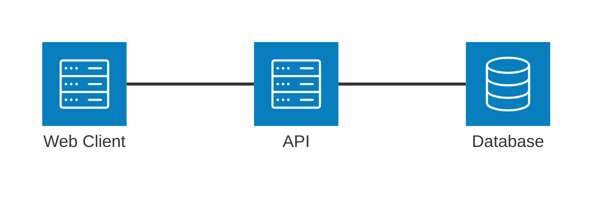
-->

---

# What do you need?

- Nothing! 
- Use an OSS library for modern authentication
  - Passkeys
  - MFA

---

# Scenario: Today's Standard App

- 1+ Backend APIs/2+ Clients
  - Maintained by separate teams
- Users stored elsewhere
  - SaaS platform
  - Custom internal service
  - Product: Duende IdentityServer, Keycloak


<!-- 

-->

---

# You Need OAuth!

- Open Standard for Access Delegation
- IdentityProvider Service manages User Authentication
- User Data lives in dedicated service
- User needs to sign in to 1+ clients (Single Sign-On)
- Complex 
  - Multiple services interacting
  - Usually not owned by same groups
  - Each application must be told to trust other applications

---

# Generalized OAuth Flow the User Sees

- 4 Steps involving redirects
  - User stored in IdentityProvider (IdP)
  - IdentityServer, Auth0, Entra, etc
- User goes through OAuth Flow to sign in and receive token


<!-- 
```mermaid
flowchart TD
    A[User Initiates Sign-In in Client] -\-> B[Client Redirects to IdP]
    B -\-> C[Allows Client Access]
    C -\-> D[Redirect to Client with Token]
```
-->

---

# OAuth Uses Multiple Types of Tokens

- Access Token
  - Authorization info like scopes, groups, some user info
  - Short lifetime
- Refresh Token
  - Used to get a new Access Token
  - Long lifetime
- Identity Token
  - User Info, name, email, job title, etc

---

# Example JWT Access Token

```json
//Header
{
  "alg": "RS256",
  "kid": "D657784EB10243008DBE5224EC87A57F", 
  "x5t": "h1G6E4kbIx--_cPHtzXanTOfjVg",
  "typ": "at+jwt" // Token type: Access Token
}
//Payload
{
  "iss": "https://demo.duendesoftware.com",
  "iat": 1789514847,
  "exp": 1789518447,
  "scope": [ "my-api:read", "user-self:read", "user-self:write" ],
  ...
}
//Signature
`D7MUrmkuHjni9Z6w......`
```

---

# Generalized API Token Validation Flow

- API must validate token
  - Not Modified
  - From trusted source - IdP
  - Has permissions to perform request


<!-- 
```mermaid
flowchart TD
    A[User Signs In, Retrieves Access and Refresh Tokens] -\-> B[User Makes Request to API, includes Access Token]
    B -\-> C[API Validates Access Token]@{ shape: diamond}
    C -\-> D[Valid Token, Processes Request]
    C -\-> E[Invalid Token, Return Error]
```
-->

---

# Where do these Best Practices come from?

- A Standards Body
- RFC 9700 - https://www.rfc-editor.org/info/rfc9700

---

# How do you establish trust among software?


<!-- 

-->

---

# Reminder: Security has Layers

- Nothing is 100% Perfect
- Mitigations built on mitigations built on mitigations built on...


---

# Attack Scenario 1: Attacker Gets Access Token

- Real Token was Created for a Valid Use Case
  - A User Signed In
  - Typed their credentials/ Used MFA / Maybe used Passkey
- How can you tell the token is leaked?

---

# Leaked Tokens Are Common

- OpenAI Employees Tokens Stolen from Discourse Server
  - https://www.hacktron.ai/blog/hacking-openai
- Hacked LiteLLM Python Package Steals Developer Credentials
  - https://www.bleepingcomputer.com/news/security/popular-litellm-pypi-package-compromised-in-teampcp-supply-chain-attack/
- Stolen Salesloft OAuth tokens used to steal data from Salesforce
  - https://www.bleepingcomputer.com/news/security/salesloft-breached-to-steal-oauth-tokens-for-salesforce-data-theft-attacks/

---

# Attacker Gets Access Token Mitigation: 
## Minimize Where Tokens Accepted

- Minimize Token Blast Radius
- Verify the Client
- Protect Refresh Token

---

# Attacker Gets Access Token Mitigation: 
## Minimize Token Blast Radius: Restrict Audience Claim to App

- Purpose: Stop attacker from using token on other APIs
- Set the Token `aud` claim
- Retrieve new Token for each API
  - Machine-to-Machine requests

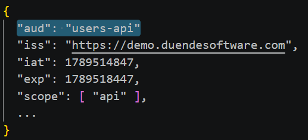

<!--
{
  "aud": "users-api"
  "iss": "https://demo.duendesoftware.com",
  "iat": 1789514847,
  "exp": 1789518447,
  "scope": [ "api" ],
  ...
} 
-->

---

# Before


<!-- architecture-beta
    service client(server)[Web Client]
    service api1(server)[API 1]
    service api2(server)[API 2]
    service api3(server)[API 3]
    service idp(cloud)[IdP]
    
    client:R -- L:idp
    client:R -- L:api1
    api1:R -- L:api2
    api2:R -- L:api3

    align row api1 api2 api3 -->

---

# After


<!-- 
architecture-beta
    service client(server)[Web Client]
    service api1(server)[API 1]
    service api2(server)[API 2]
    service api3(server)[API 3]
    service idp(cloud)[IdP]
    
    client:R -- L:idp
    client:R -- L:api1
    api1:R -- L:api2
    api2:R -- L:api3

    api1:T -- R:idp
    api2:T -- R:idp
    api3:T -- R:idp

    align row api1 api2 api3 
    -->

---

# Attacker Gets Access Token Mitigation: 
## Minimize Token Blast Radius: Restrict Scopes to App Requirement

- Purpose: Stop attacker from using token on other endpoints
- Client only requests Scopes the app needs

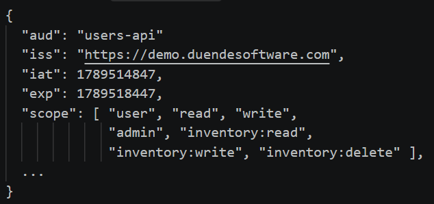

<!--
{
  "aud": "users-api"
  "iss": "https://demo.duendesoftware.com",
  "iat": 1789514847,
  "exp": 1789518447,
  "scope": [ "user", "read", "write", "admin", "inventory:read", "inventory:write", "inventory:delete" ],
  ...
} 
-->

---

# Attacker Gets Access Token Mitigation: 
## Verify the Client: Confidential Clients

```text
Authorization servers SHOULD enforce client authentication if it is feasible
```
- Purpose: Don't Let Anyone Make Custom Clients (custom script)
- Client proves to Auth Server it is who it says it is
- Enabled with mTLS or Signed Tokens
  - No client secret string
- https://duendesoftware.com/blog/20260903-client-secrets-mutual-tls-and-private-key-jwt

---

# Attacker Gets Access Token Mitigation: 
## Verify the Client: Confidential Clients: mTLS aka Mutual TLS

- Client and Auth Server validate each other with Certificates
- Most Complex Confidential Client

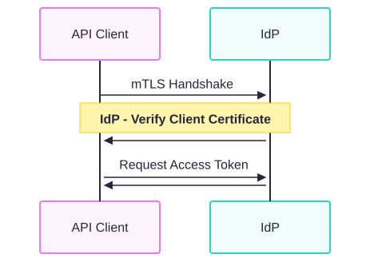

<!-- 
sequenceDiagram
    API Client ->>+IdP: mTLS Handshake
    Note over API Client,IdP: IdP - Verify Client Certificate
    IdP->>+API Client:
    API Client ->>+IdP: Request Access Token
    IdP->>+API Client: 
-->


---

# Attacker Gets Access Token Mitigation: 
## Verify the Client: Confidential Clients: Signed JWT

- No certificate infrastructure to manage

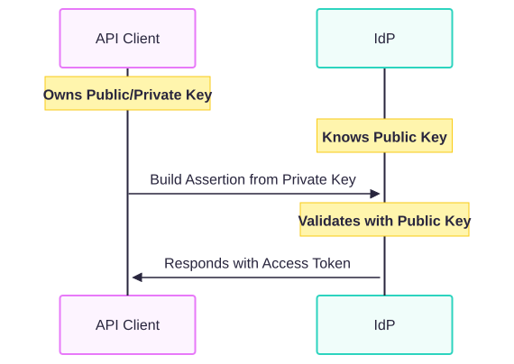

<!-- ```
sequenceDiagram
    Note over API Client: Owns Public/Private Key
    Note over IdP: Knows Public Key
    API Client ->>+IdP: Build Assertion from Private Key
    Note over IdP: Validates with Public Key
    IdP->>+API Client:Responds with Access Token
``` -->

---

# Attacker Gets Access Token Mitigation: 
## Verify the Client: Demonstrating Proof of Possession (DPoP)

- Purpose: API knows token always comes from same client
  - Note: In addition to Signed JWT/mTLS
- https://duendesoftware.com/blog/20251216-security-lingo-explained-dpop

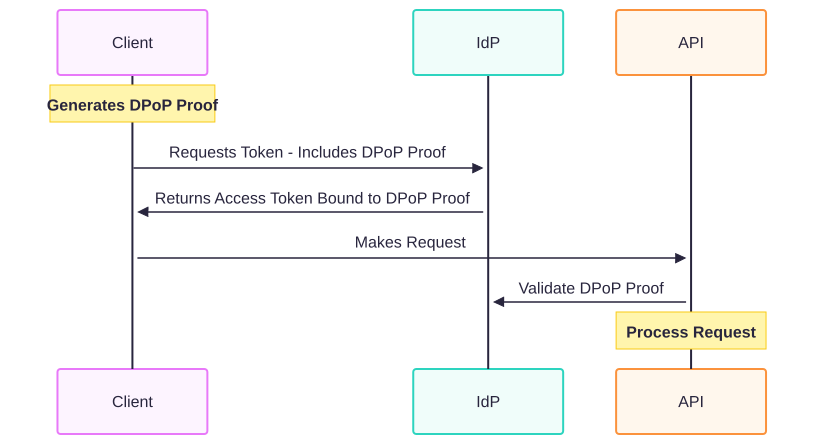

<!-- 
sequenceDiagram
    Note over Client: Generates DPoP Proof
    Client ->>+IdP: Requests Token - Includes DPoP Proof
    IdP->>+Client:Returns Access Token Bound to DPoP Proof
    Client ->>+API: Makes Request
    API->>+IdP: Validate DPoP Proof
    Note over API: Process Request 
-->

---

# Attacker Gets Access Token Mitigation: 
## Protect Refresh Token

- Refresh Tokens == High Value

---

# Attacker Gets Access Token Mitigation: 
## Protect Refresh Token: Rotate on each use

- When token used once, not usable anymore

---

# Attacker Gets Access Token Mitigation: 
## Protect Refresh Token: Server-Side Sessions

- Revoke tokens when needed
  - Internally by admins or externally by individual users

---

# Attack Scenario 2: Attacker Can See Requests
<!-- # Best Practice: Protect at Request Level -->

- Attacker in the Middle
- Interactive flow of user signing-in
- Malicious Actor Intercepts the Token
- Forces Browser to Make Silent Request to Website

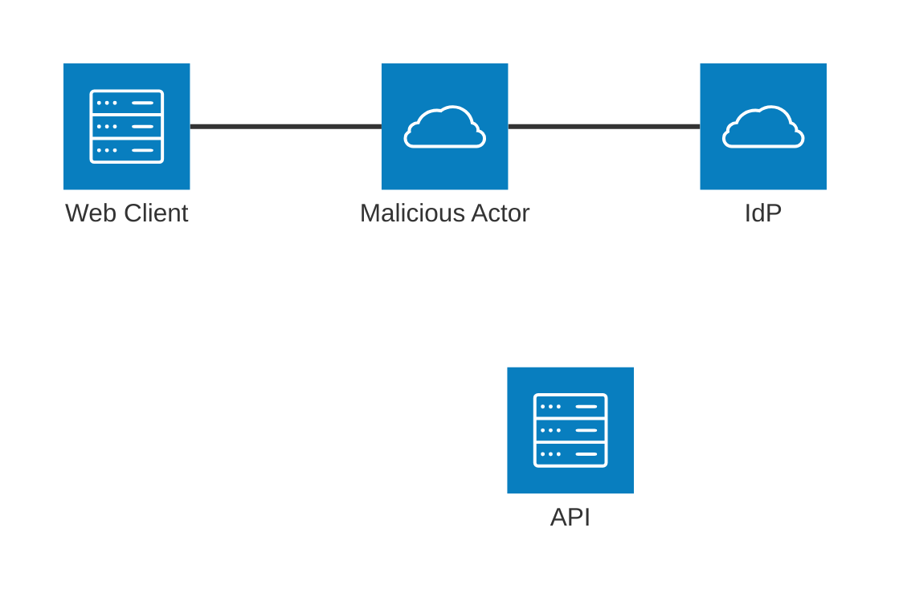

---

# Attacker Can See Requests Mitigation: 
## Don't Let Attacker Replay Requests

- Purpose: Ensure same Client and IdP instances talk to each other the whole time
- Use All 3
  - Cross Site Request Forgery (CSRF)
  - Nonce
  - PKCE

---

# Attacker Can See Requests Mitigation: 
## Don't Let Attacker Replay Requests: CSRF

```text
Clients MUST prevent Cross-Site Request Forgery (CSRF)...requests to the redirection endpoint that do not originate at the authorization server, but at a malicious third party...
```
- Purpose: Stops request replay attacks, CSRF changes on each page load
  - Simple and effective
- Malicious Site with hidden link is
  - Ex: https://important-site.com/callback?code=ATTACKER_CONTROLLED_CODE
- Random string to gate future request
  - Request blocked if string is wrong

<!-- TODO: Diagram -->

---

# Attacker Can See Requests Mitigation: 
## Don't Let Attacker Replay Requests: Nonce

- Purpose: Client Security, Ensures Client Requests With Same Auth Server
- Number Used Once
- Client generates random string `nonce`
  - Included in initial auth request
- Final Token includes `nonce`
- Client validates the Token `nonce` matches value in original request

<!-- TODO: Diagram or JWT -->

---

# Attacker Can See Requests Mitigation: 
## Don't Let Attacker Replay Requests: PKCE

- Purpose: Ensure same client used for all Auth requests
- Client generates random string `code_verifier`
  - Included in requests to Auth Server
- Auth Server doesn't return `code_verifier`
  - `code_verifier` can't be intercepted by response

<!-- TODO: Diagram -->

---

# Even Better Practice: 
## Don't Send Tokens to Uncontrolled Endpoints

- ie, Only send tokens to YOUR endpoints

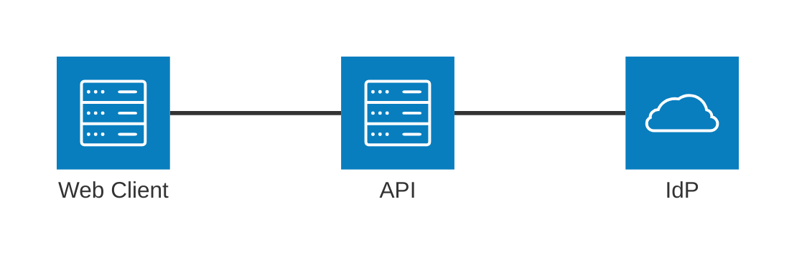

---

# Attack Scenario 3: Client Used Malicious Input Values

- Bad Redirect
- Clickjacking aka User Interface Redressing

---

# Client Used Malicious Input Values Mitigations: Ensure Client Communicates with You

- Don't let client choose redirectors (Avoid HTTP 307)
- Context Security Policy (CSP)

---

# Client Used Malicious Input Values Mitigation: Ensure Client Communicates with You: 
## Avoid HTTP 307

- Scenario:
  1. User submits credentials
  1. Auth Server Accepts, returns a Redirect

- With HTTP 307 (Temporary Redirect), browser sends same request
  - Includes user credentials
- Mitigation: Use HTTP 302 (Found)
  - New request, doesn't include credentials

---

# Client Used Malicious Input Values Mitigation: Ensure Client Communicates with You: 
## CSP aka Client Security Policy

- CSP: Website can only talk to known endpoints
- For Clickjacking Attack
- Malicious JS ends up in your frontend
  - Ex: Hacked NPM package

---

# Extra Credit: 
## FAPI 2.0

- Security Profile
- High Value Scenarios
  - Financial, Health, Government
- https://openid.net/specs/fapi-security-profile-2_0-final.html

---

# Extra Credit: RFC 10017 aka BCP 212
## Backend For Frontend Pattern

- Don't store tokens in client
- Proxy requests through a single backend to other backends
- https://duendesoftware.com/blog/the-backend-for-frontend-pattern-is-now-official-ietf-guidance-rfc-10017-published

---

# Anything about A.I.?

- No spec yet, in progress
- General Practice: 
  - Nothing Changes Much
  - Follow OAuth best practices

---

# Review

- Limit where tokens can be used
- Secure your clients
- Don't let requests get replayed


